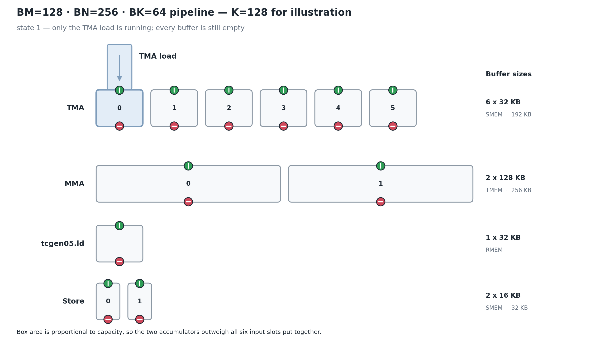
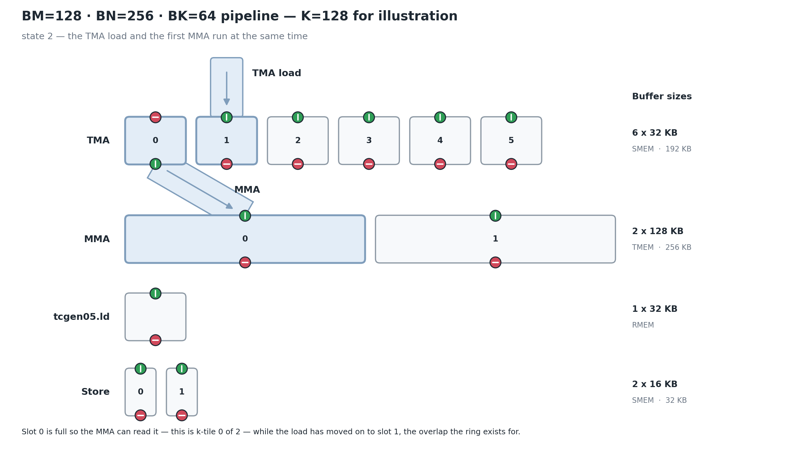
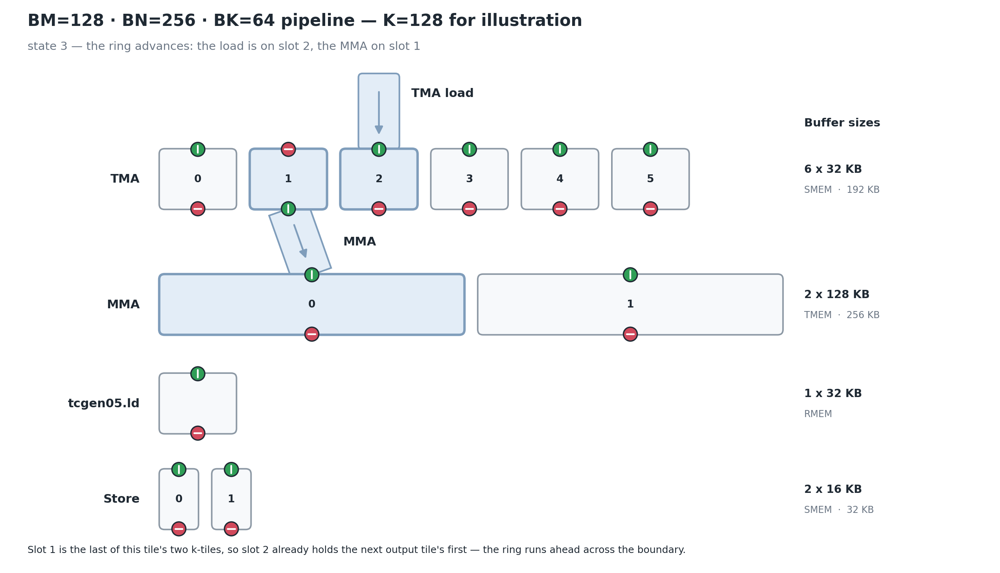
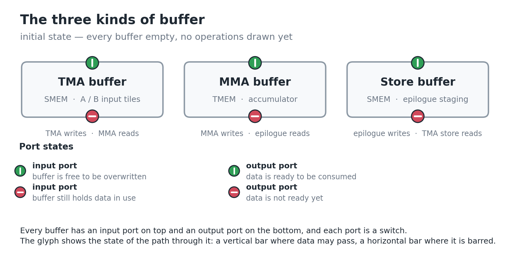
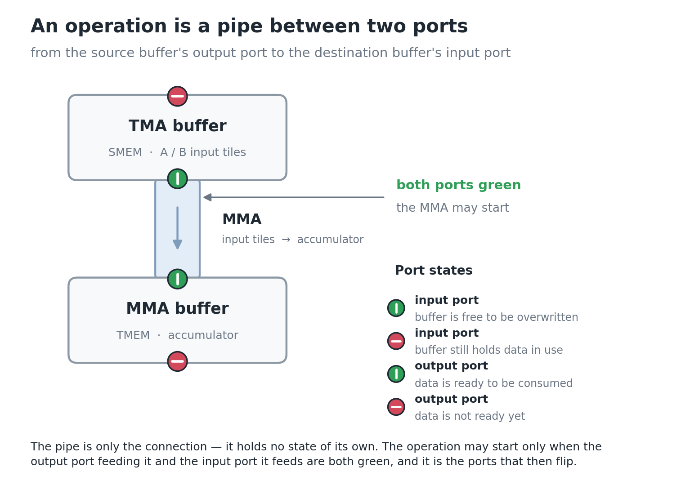
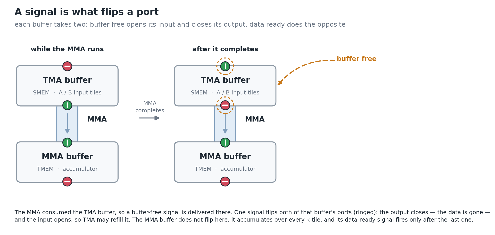
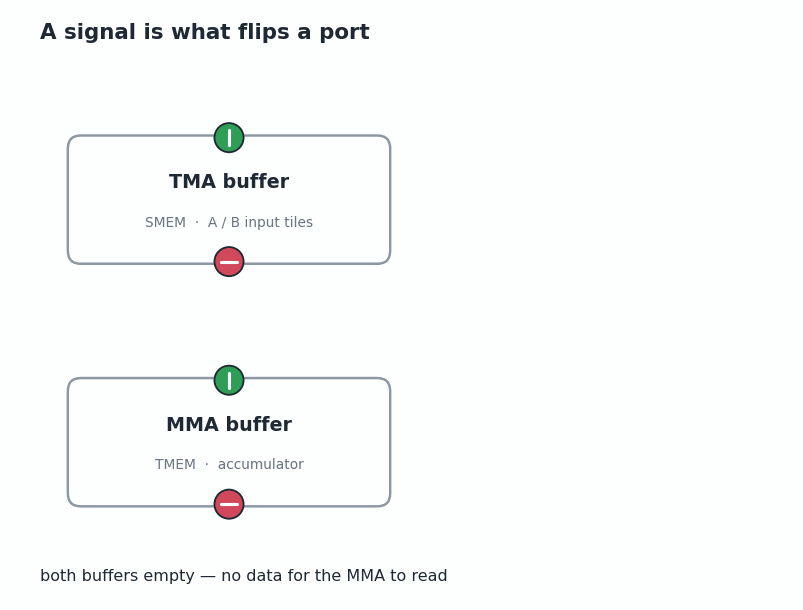
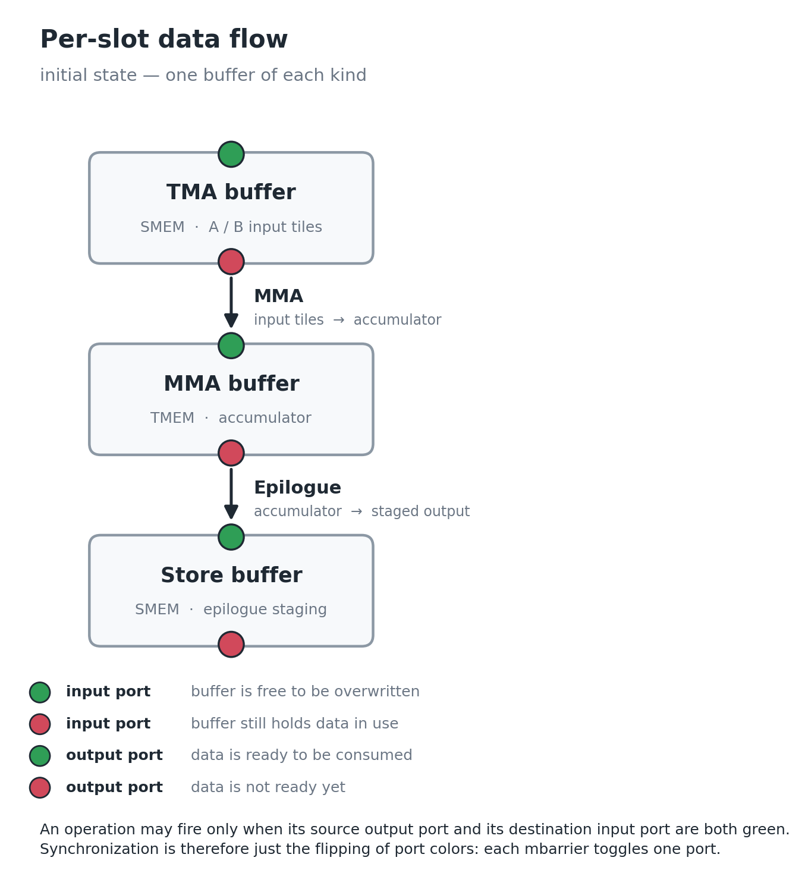

# Data-flow models

Figures for reasoning about GEMM pipeline scheduling on B200 as a data-flow
problem. `render.py` generates every figure into `figures/` as both SVG and PNG:

```bash
python data-flow-models/render.py
```

## The model

Four kinds of buffer:

| Buffer | Lives in | Holds | Written by | Read by |
|---|---|---|---|---|
| TMA buffer | SMEM | A / B input tiles | TMA | MMA |
| MMA buffer | TMEM | the accumulator | MMA | `tcgen05.ld` |
| `tcgen05.ld` buffer | RMEM | `tcgen05.ld` results | `tcgen05.ld` | epilogue |
| Store buffer | SMEM | epilogue output staged for the write-back | epilogue | TMA store |

Each buffer is a box with two **ports**: an input port on top and an output port
on the bottom. An **operation** is an edge from one buffer's output port to
another buffer's input port — `MMA` runs from the TMA buffer to the MMA buffer,
`Epilogue` from the MMA buffer to the store buffer.

A port is a switch with two states:

| | green, vertical bar | red, horizontal bar |
|---|---|---|
| **input port** | buffer is free to be overwritten | buffer still holds data in use |
| **output port** | data is ready to be consumed | data is not ready yet |

Each port carries its state twice over: colour, plus a glyph for the state of the
path through it — a vertical bar where data may pass, a horizontal bar where it
is barred. The glyph keeps the figures readable in grayscale and for red-green
colourblind readers, and it describes the *path* rather than the buffer's
contents, which matters because green means opposite occupancy on the two ports:
a green input port is an empty buffer, a green output port a full one.

(The prose deliberately avoids "open" and "closed" for these states — an open
gate suggests flow but a closed circuit also means flow, and readers split on
which one is permissive.)

**An operation may fire only when its source's output port and its destination's
input port are both green.**

A **signal** is the only thing that changes a port's state, and it is addressed
to a buffer rather than to one port — one signal flips both. Each buffer takes
two kinds:

| Signal | Effect on the buffer it is sent to |
|---|---|
| **buffer free** | opens the input port, closes the output port — the data has been consumed, so it may be refilled |
| **data ready** | opens the output port, closes the input port — the buffer has been filled, so it may be read |

That is the whole model, and it is what makes it useful: synchronization is
nothing more than flipping port states. Every mbarrier in a kernel toggles one
port, and every stall is an operation waiting for one of its two ports to turn
green. Scheduling questions — how deep to make a ring, when to release an
accumulator, whether to split a barrier — become questions about which port
flips when.

## Figures

### `bn256-state1-tma-load`

The whole BM=128 / BN=256 / BK=64 pipeline, drawn to scale: six 32 KB TMA slots,
two 128 KB TMEM accumulators, one 32 KB register buffer for the `tcgen05.ld`
results, two 16 KB store buffers. Box area is proportional to capacity, which is
the point of drawing them together — the two accumulators outweigh all six input
slots put together.

K is 128 throughout this sequence, so an output tile takes exactly two k-tiles —
few enough that the states can walk through a whole one.

State 1: only the TMA load is running. Nothing has produced
anything yet, so every output port is red and no operation *between* buffers can
fire. The one thing that can run is the load from memory, drawn as a pipe with
no source buffer — global memory is not a buffer in this model.



### `bn256-state2-tma-and-mma`

State 2: the TMA load and the first MMA run at the same time. Slot 0 is full, so
its output port is green and the MMA can read it — this is k-tile 0 of 2 — while
the load has moved on to slot 1, the overlap the multi-stage ring exists for. Buffers an operation is
touching are tinted in the pipe colour.

The MMA buffer's ports do not change while it accumulates: its input stays green
because the MMA keeps writing to it, and its output stays red until the last
k-tile of the output tile is in.



### `bn256-state3-ring-advances`

State 3: the ring has advanced one slot. Slot 0 was consumed, so a buffer-free
signal returned it to empty and it is available to the load again; the load is
on slot 2 and the MMA on slot 1.

With K=128, slot 1 holds the *last* of this output tile's two k-tiles, so the
accumulator is about to be complete — its output is still red only because this
MMA has not finished. Slot 2 therefore already holds the *next* output tile's
first k-tile: the ring runs ahead across the tile boundary.



### `buffer-kinds`

The four kinds of buffer in a 2x2 grid, with no operations between them. They
are placed so the data flow runs clockwise — TMA to MMA across the top, down to
the `tcgen05.ld` buffer, then left to the store buffer — which is the shape the
operation edges will take once they are drawn. This figure introduces the
vocabulary only: what buffers exist, where they live, and that
each has an input port on top and an output port on the bottom. Drawn in the
initial state — every buffer empty, so every input port green and every output
port red.

It carries no port-state legend: the glyphs and the one-line caption say enough,
and four legend rows next to four buffers was more text than the figure needed.



### `operation-as-pipe`

How an operation is modelled: a pipe joining the source buffer's output port to
the destination buffer's input port, drawn here for the MMA between the TMA
buffer and the MMA buffer. The pipe is only the connection — it holds no state
of its own; the ports do.

The state shown is one where the MMA may actually start, rather than a contrived
all-green one: the TMA buffer is full (input red, output green) and the MMA
buffer is empty (input green, output red), which is exactly both-green across
the pipe.



### `signal-flips-a-port`

One full turn of the handshake, in three states side by side. **Data ready**
opens the TMA buffer's output port, at which point both ends of the MMA pipe are
green and the pipe appears; **buffer free** closes it again once the MMA has
drained the buffer. The two signals are the labelled transitions between states,
and the ports each one flips are ringed.

The pipe is drawn only while it could actually carry data — that is the firing
rule made visible, rather than stated.

The MMA buffer never flips here: it accumulates over every k-tile, so its own
data-ready signal fires only after the last one. (That reading is kept here
rather than captioned on the figure, which carries no body text.)



The same handshake is also generated as a GIF, `signal-flips-a-port.gif`, for
posts that can show one. It walks the same states one at a time, with a caption
narrating each. The static figure is the primary — it survives print, PDF and
feed readers — and the two are generated from the same primitives, so they
cannot drift apart.



### `per-slot-initial-state`

One buffer of each kind, in the state the pipeline starts in: every buffer is
empty, so every input port is green (free to overwrite) and every output port is
red (nothing to hand on). Neither operation can fire yet — each is waiting for
its source's output port to turn green, which only the upstream producer can do.


