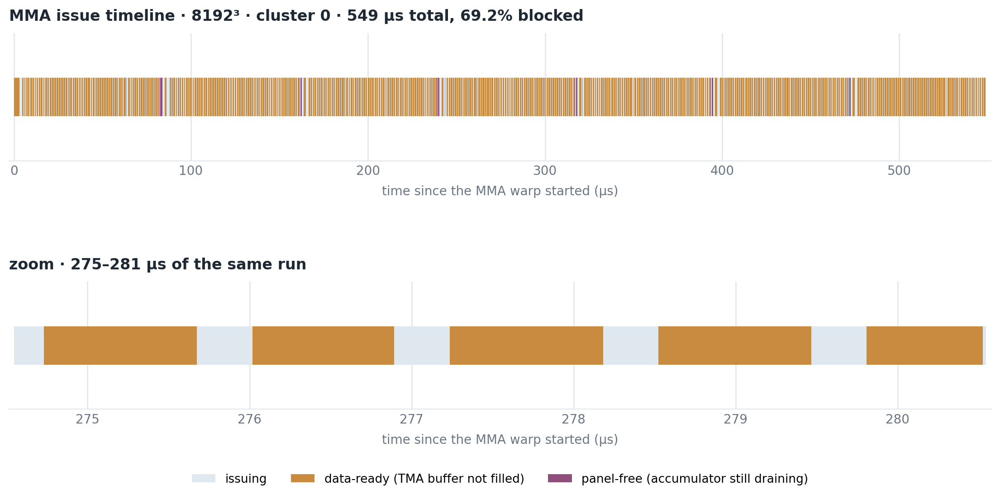

# Profiling where MMA issue blocks

A timeline of the MMA warp's stalls, built by instrumenting the kernel rather
than by sampling. It answers one question directly: from start to finish, at
what points can the MMA warp not issue, and what is it waiting for.



## Two kinds of blocking, and only two

The data-flow model says an operation may start only when its source buffer is
readable and its destination buffer is writable. For the MMA warp those are:

* **data-ready** — the TMA buffer it is about to read has not been filled yet
* **panel-free** — the accumulator panel it is about to write is still being
  drained by the epilogue

They are recorded as distinct event kinds and drawn in distinct colours,
because they call for opposite fixes: data-ready stalls want more or deeper TMA
buffers, panel-free stalls want a faster or earlier drain.

## How it is instrumented

Every wait in the MMA warp is routed through `wait_phase_prof`, which first
probes the barrier with a **non-blocking** `mbarrier.test_wait`:

```cuda
if (barrier_ready(mb, phase)) { wait_phase(mb, phase); return; }  // no event
const uint64_t t0 = prof_clock();
wait_phase(mb, phase);
const uint64_t t1 = prof_clock();
```

A wait that was already satisfied records nothing and costs one predicated
test. Only a genuine block reads `%clock64`, waits, and reads it again, so the
instrumentation cannot manufacture the stalls it is measuring. Passing
`nullptr` for the buffer disables everything, so the same cubin can be timed.

Events land in a per-cluster slice of a global buffer — `[count, t_base, then
4 u64 per event]` — with kind, TMA slot or panel index, output-tile index, k
index, and the two timestamps. The MMA warp is a single elected thread, so no
atomics are needed. The instrumented kernel compiles to the same 135 registers
as its parent, with no spills.

## What it shows

`bf16-single-ns2-store2-bk128-bn512-load256-w8-splitacc` at 8192³, one cluster:

| | |
|:---|---:|
| MMA warp lifetime | 549 µs |
| blocked | 69.2% |
| of that, data-ready | **98.3%** |
| of that, panel-free | **1.7%** |

The first eight clusters agree within a few points (65–70% blocked), so this is
not one unlucky cluster.

**Read the 69% carefully.** It is issue-side stall, not MMA-unit idle time. The
MMA unit runs asynchronously: the warp issues a chain, runs ahead, and then
waits. A well-pipelined kernel is *expected* to show its issue warp waiting most
of the time — what would indicate a real problem is the MMA unit starving, which
this instrumentation does not measure directly.

The informative number is the split. Essentially all issue-side waiting is on
TMA data; the accumulator is almost never what holds MMA up. For a design whose
entire premise is releasing accumulator panels early, that is the result you
want: **splitacc has taken the epilogue off the critical path at this shape**,
and what remains is memory.

The zoom panel shows the steady-state rhythm — issue, block on data-ready,
issue — with a period of roughly 1.2 µs per k-tile.

## Caveats

* `%clock64` is per-SM, so timelines are per-cluster and relative to that
  cluster's own start. They cannot be laid on one absolute axis without also
  recording `%globaltimer`.
* Events are capped at `PROF_MAX_EVENTS` (8192) per cluster; beyond that they
  are dropped rather than wrapped.
* Only the MMA warp is instrumented. The TMA and epilogue warps have their own
  waits, and a fuller picture would record those too.
